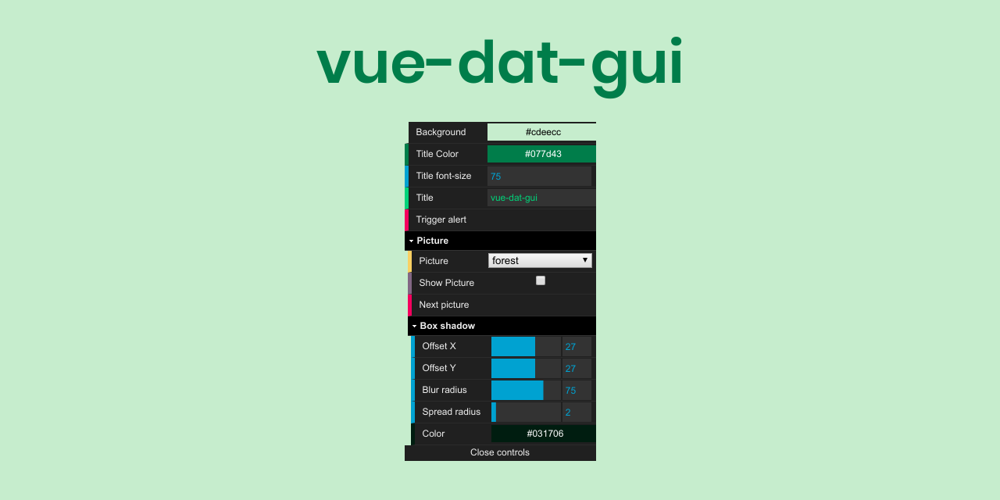

# vue-dat-gui



> A Vue.js port of the popular [dat.GUI](https://github.com/dataarts/dat.gui) library.

This is a lightwieght graphical user interface to change variables in Javascript.
Useful for all your demo or experiment code.

## DEMO ✨

Check out the [demo page](https://cyrilf.github.io/vue-dat-gui/).

### Used by:

- [cyrilf/microbios](https://microbios.cyrilf.com/): Cellular automata simulation / [Github](https://github.com/cyrilf/microbios)
- ...
- _Feel free to submit a PR to add your website._

---

## INSTALL 💻

### Option 1 - Install from NPM

```
npm install --save @cyrilf/vue-dat-gui
```

Then the usage is:

```js
import Vue from 'vue'
import DatGui from '@cyrilf/vue-dat-gui'

Vue.use(DatGui)
```

### Option 2 - Instal via umd file


In your head tag, include the following code:
```html
<script src="https://unpkg.com/vue@2.6.10/dist/vue.js"></script>
<script src="https://unpkg.com/@cyrilf/vue-dat-gui@latest/dist/vue-dat-gui.umd.min.js"></script>
```

----

## USAGE 🖱

You can always refer to the [public/index.html](https://github.com/cyrilf/vue-dat-gui/tree/master/public/index.html) file for the most up-to-date example of how to use it. The [demo page](https://cyrilf.github.io/vue-dat-gui/) is also available.

In your view:

```html
<div class="app">
  <dat-gui closeText="Close controls" openText="Open controls" closePosition="bottom">
    <dat-color v-model="background" label="Background"/>
    <dat-number v-model="titleFontSize" label="Title font-size"/>
    <dat-string v-model="title" label="Title"/>
    <dat-button @click="triggerAlert" label="Trigger alert"/>
    <dat-folder label="Picture">
      <dat-select v-model="pictureUrl" :items="pictures" label="Picture"/>
      <dat-boolean v-model="showPicture" label="Show Picture"/>
      <dat-folder label="Box shadow">
        <dat-number v-model="boxShadow.offsetX" :min="-100" :max="100" :step="1" label="Offset X"/>
        <dat-number v-model="boxShadow.offsetY" :min="-100" :max="100" :step="1" label="Offset Y"/>
        <dat-number v-model="boxShadow.blurRadius" :min="0" :max="100" :step="1" label="Blur radius"/>
        <dat-number v-model="boxShadow.spreadRadius" label="Spread radius"/>
        <dat-color v-model="boxShadow.color" label="Color"/>
      </dat-folder>
    </dat-folder>
  </dat-gui>
</div>
```

In your javascript:

```js
import Vue from 'vue'
import DatGui from '@cyrilf/vue-dat-gui'

Vue.use(DatGui)

new Vue({
      el: '#app',
      data() {
        return {
          background: '#cdeecc',
          titleFontSize: 75,
          title: 'vue-dat-gui',
          showPicture: true,
          pictures: [{ name: 'forest', value: '...' }, { name: 'mountain', value: '...' }],
          pictureUrl: pictures[0].value,
          boxShadow: {
            offsetX: 27,
            offsetY: 27,
            blurRadius: 75,
            spreadRadius: 2,
            color: 'rgba(3, 23, 6, 1)',
          },
        }
      },
      methods: {
        triggerAlert() {
          alert('Yeah, you pressed it!')
        },
      }
    })
```

----


## CONTRIBUTE 🖋

Here are the different options:

```
npm install
```

### Compiles and minifies for production
```
npm run build
```

### Lints and fixes files
```
npm run lint
```

### Customize configuration
See [Configuration Reference](https://cli.vuejs.org/config/).
This project was generated using `vue-cli`.

Feel free to open any Pull Request/Issues.


----

## THANKS 👌

- [dat.GUI](https://github.com/dataarts/dat.gui) for initial project
- [joeslyon/vue-dat-gui](https://github.com/joeslyon/vue-dat-gui) for inspiration
